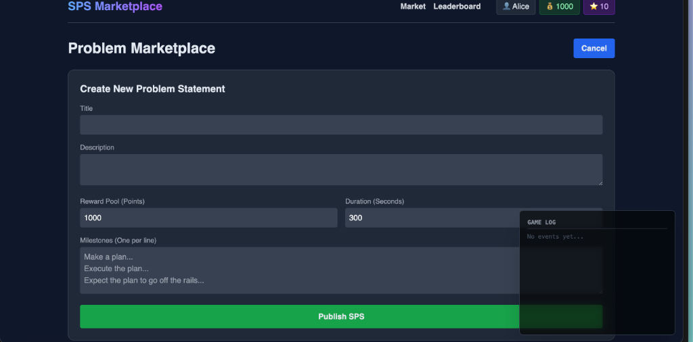

# SPS Marketplace Simulation

A **real-time multiplayer economic game** that simulates a "Problem Marketplace". Players create problems (SPS), speculate on their tokens, and solve milestones to earn reputation and points.



## 🎮 The Game
This is an economic experiment designed to observe human behavior, information asymmetry, and market dynamics.

- **Creators**: Post problems with deadlines and reward pools.
- **Speculators**: Buy/Sell tokens based on confidence in the problem being solved.
- **Doers**: Opt-in to solve milestones and earn rewards.

## 🚀 Getting Started

### Prerequisites
- Node.js v18+ (v20 recommended)

### 1. Start the Server
The centralized game server handles state, matchmaking, and the market loop.
```bash
cd server
npm install
node server.js
```
Runs on `http://localhost:3000`.

### 2. Start the Client
The specific frontend features a real-time market dashboard.
```bash
cd client
npm install
npm run dev
```
Runs on `http://localhost:5173`.

## 🕹️ How to Play

1. **Lobby**: Enter your username to join the simulation.
2. **Market**: View active problems (SPS).
   - **Buy Token**: If you think the problem will be solved (or price will go up).
   - **Sell Token**: Take profits or cut losses.
3. **SPS Detail**:
   - **Claim Task**: Become a 'Doer' for a specific milestone.
   - **Submit Work**: Complete the task to unlock rewards and pump the token price.
4. **Settlement**:
   - If milestones pass: Token holders get paid 100 per token.
   - If failed: Tokens go to 0.

## ⚠️ Notes for Players
- **Information Asymmetry**: Creators know if they will validate the work. Watch their trades.
- **Volatility**: Prices fluctuate based on time remaining and milestone progress.
- **Exploits**: The system is designed to be exploited. Insider trading is possible.

## Tech Stack
- **Backend**: Node.js, Express, Socket.io (In-memory state)
- **Frontend**: React, Vite, Tailwind CSS, Recharts
- **Communication**: WebSockets for real-time state sync (60fps updates not guaranteed, but optimized for "game feel").
